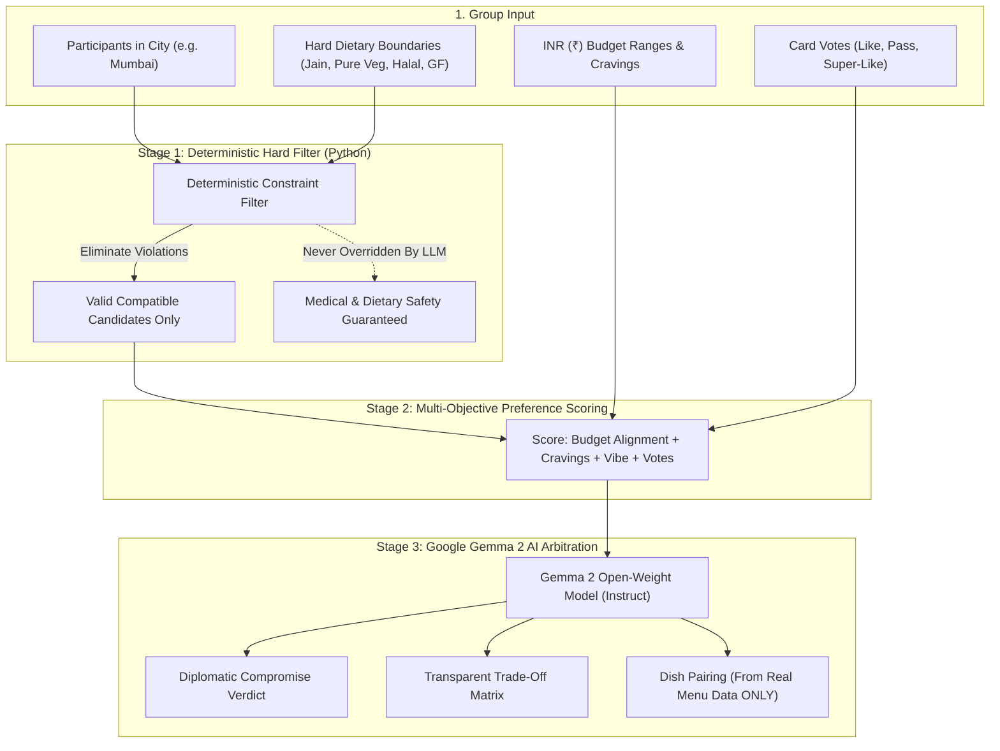

# 🍽️ BiteVote (India Edition) — Vote. Match. Eat.

> **The AI-Powered Compromise Engine that ends the 45-minute "Where should we eat?" debate forever.**  
> Built for the **Hacktoberfest 2026 Weekend Challenge: Build for a Friend** (`#devchallenge #weekendchallenge #hf26challenge`).

[-8b5cf6.svg)](https://ai.google.dev/gemma)
[](https://www.mongodb.com/atlas)
[](https://render.com)
[](https://fastapi.tiangolo.com)
[](https://react.dev)
[](#)

---

## 🎯 The "Build for a Friend" Story (India First)

Every Friday evening across Indian cities, friend groups and families hit the same dining deadlock:
* **Sarah** is strict **Jain** (strictly no onion, garlic, potatoes, or root vegetables) with a budget of ₹300–₹500 and a craving for authentic **Maharashtrian / Street Food**.
* **Rahul** is **Vegetarian** with a budget of ₹400–₹700 craving **North Indian tandoor**.
* **Aisha** is **Vegetarian** with a budget of ₹300–₹600 craving fiery **Indo-Chinese**.
* Others in the group want to stay strictly within a fair ₹ budget without unexpected splurge bills.

Existing dining apps fail because simple majority voting ignores non-negotiable dietary boundaries (like Jain kitchens or Halal standards) or picks a place where one friend can only drink tap water.

**BiteVote solves this.** Friends join a room, select their city (Mumbai, Pune, Delhi NCR, Bengaluru, Hyderabad, Chennai, Kolkata, Ahmedabad, Navi Mumbai), enter dietary boundaries, swipe on candidate spots, and let **Google Gemma 2** act as an impartial culinary diplomat.

---

## 🧠 2-Stage Recommendation Engine Architecture



### 1. Deterministic Hard-Constraint Filter
* **Zero Dietary Compromises:** Restaurants lacking dedicated Jain preparations, pure vegetarian discipline, or Halal compliance are automatically eliminated *before* AI evaluation.
* **The LLM is NEVER permitted to override hard dietary or allergy constraints.**
* **Never claims a dish is allergy-safe unless the underlying data explicitly says so.**

### 2. Preference Scoring
Remaining compatible candidates are scored across:
* Dietary compatibility bonus
* Budget alignment against group budget ranges (in ₹)
* Cuisine cravings (Maharashtrian, North Indian, Indo-Chinese, South Indian, Biryani, etc.)
* Vibe (Family Dining, Irani Cafe, Street Food Hub, Rooftop)
* Individual votes (Likes vs Skips/Vetos)

### 3. Gemma 2 Open-Weight Arbitration
* Powered by **Google Gemma 2** (`google/gemma-2-27b-it`) hosted via OpenRouter.
* Generates an empathetic, witty **diplomatic verdict** explaining why the winner solves the deadlock.
* Creates a **Transparent Trade-Off Matrix** (*"Who gave up what & what did they win"*).
* Generates **Personalized Dish Suggestions** selected **ONLY from the restaurant's actual menu data** with ₹ prices (never invented menu items or medical safety claims).

---

## 🏙️ Supported Indian Cities & Cuisines

* **Cities:** Mumbai, Pune, Delhi NCR, Bengaluru, Hyderabad, Chennai, Kolkata, Ahmedabad, Navi Mumbai.
* **Cuisines:** Maharashtrian, North Indian, South Indian, Gujarati Thali, Punjabi, Mughlai, Indo-Chinese, Biryani & Kebabs, Street Food / Chaat, Continental / Bakery, Asian & Italian.
* **Place Types:** Iconic Pure Veg dining, Heritage Irani cafes, Thali feasts, Street food centers, Multicuisine family spots, Rooftops.
* **Currency:** 100% INR (**₹**) with transparent per-person and cost-for-two metrics.
* **UI & Avatars:** Polished food-tech design with Lucide product icons and illustrated Indian human profile avatars across lobby, voting, and results (zero decorative emoji styling).

---

## 🏆 Hacktoberfest Prize Target Qualifications

| Sponsor Prize | Why BiteVote Qualifies |
|---|---|
| **Google Gemma — Best Use of Gemma ($200)** | Google Gemma 2 (`google/gemma-2-27b-it` via OpenRouter) is the core optimization engine driving multi-objective constraint arbitration, structured compromise reasoning, concession breakdowns, and personalized dish suggestions. |
| **Render — Best Use of Render ($200)** | Fully specified Render deployment via `render.yaml` Blueprint, building the Vite frontend and running the unified FastAPI service with zero downtime. |
| **MongoDB Atlas — Best Use of MongoDB Atlas ($100)** | Utilizes MongoDB Atlas official async driver (**PyMongo Async** `AsyncMongoClient`) with document schemas for Rooms, Real-Time Participants, Vote Tallies, and AI Decision records. |

---

## 🚀 Quick Start (Local Development)

### 1. Set Up Backend

```powershell
# In D:\Antigravity\Projects\BiteVote
python -m venv backend/venv
.\backend\venv\Scripts\activate
pip install -r backend/requirements.txt
```

### 2. Run Automated Tests

```powershell
.\backend\venv\Scripts\pytest .\backend\tests
```

### 3. Run Application

```powershell
# Unified mode (serves frontend & backend on port 8000)
.\backend\venv\Scripts\python -m uvicorn backend.main:app --port 8000 --reload
```
Open **`http://localhost:8000`** in your browser.

Or run the frontend in Vite dev mode:
```powershell
cd frontend
npm run dev
```
Open **`http://localhost:5173`**.

---

## ⚡ Try the 1-Click Mumbai Demo

1. Open `http://localhost:8000`.
2. Click **"⚡ Try Mumbai 3-Friend Demo (1-Click)"**.
3. It loads the exact prompt scenario:
   * **Sarah (Host):** Jain + ₹300–500 + Maharashtrian
   * **Rahul:** Vegetarian + ₹400–700 + North Indian
   * **Aisha:** Vegetarian + ₹300–600 + Indo-Chinese
4. Click **"Summon Gemma AI Verdict!"** to watch Gemma arbitrate the compromise, celebrate with confetti, reveal the trade-off matrix, and recommend real dishes from the menu!

---

## 📄 License

Distributed under the MIT License. See [LICENSE](LICENSE) for details.
